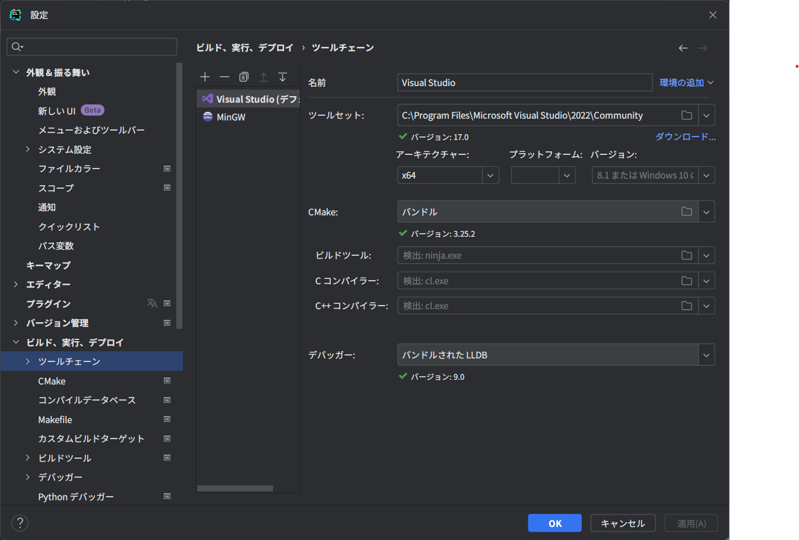
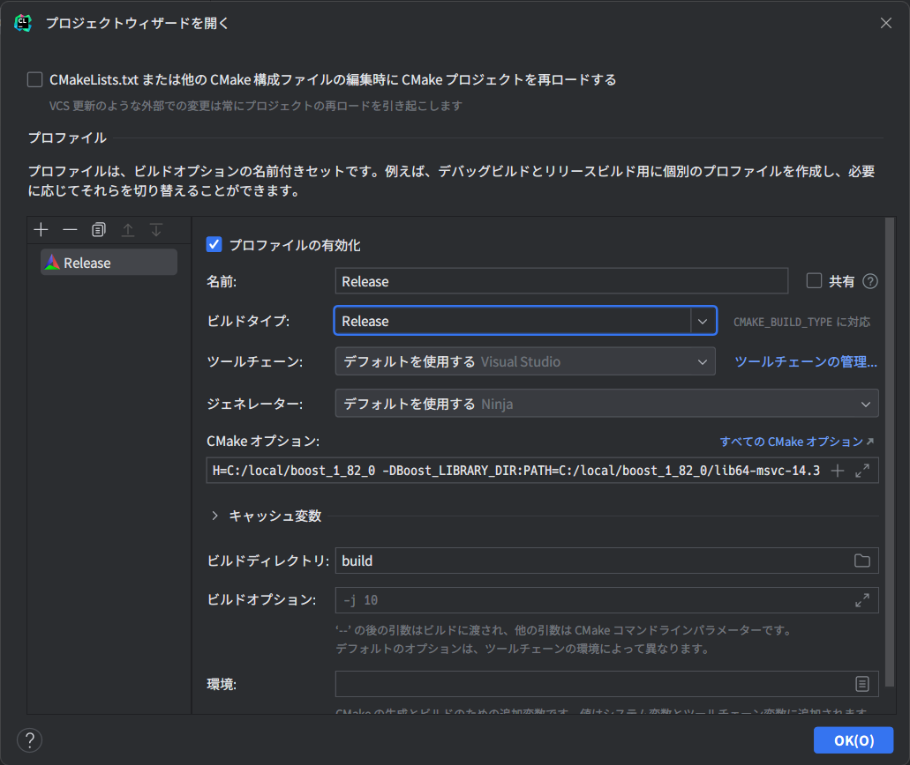

# usrp_sounder

## 環境構築
[導入手順（日本語）](https://www.notion.so/Building-and-Installing-UHD-from-source-869372f23ae245559f6a75424d02846a?pvs=4)

### Windows用 CLion設定
設定->ビルド、実行、デプロイを選択し，それぞれ以下のように設定
* ツールチェーン


* CMake


#### CMake オプション
以下は上記手順通りに導入した場合の例（実際のパスに合わせて適宜変更）
```
-DBoost_INCLUDE_DIR:PATH=C:/local/boost_1_82_0 -DBoost_LIBRARY_DIR:PATH=C:/local/boost_1_82_0/lib64-msvc-14.3
```
